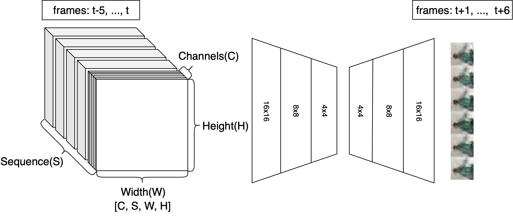
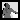

# Improving State-of-the-Art GAN Video Synthesis
We propose multiple methods for improving state-of-the-art GAN-based video synthesis approaches. We show that GANs using 3D-convolutions for video generation can easily be extended to predicting coherent depth maps alongside RGB frames, but results indicate that this does not improve RGB accuracy if depth is available. We further propose critic-correction, a method for improving videos generated by latent space curve fitting. Additionally, we study the effect of Principal Component Analysis as well as different backprojection methods on the quality of generated videos.

A full report on our work can be found at ./Report/ViDGAN.pdf
## Incorporating Depth
We extended an existing 3D-convolution GAN architecture to study the effect of depth information on video synthesis.
### Code
Our code is based on the [FutureGAN](https://github.com/TUM-LMF/FutureGAN) implementation by Aigner and Körner and can be found at ./FutureGAN_Depth.
For training, we used Google Colaboratory, the training script is located at FutureGAN_Depth/Training_Depth.ipynb.

### Method

We extended the [FutureGAN](https://github.com/TUM-LMF/FutureGAN) architecture by incorporating normalized dense depth maps as an additional input and/or output channel. 
### Results
We conducted an ablation study to study the effect of depth information on generated videos. A sample sequence from the test set can be found below:

| Ground Truth | RGB &rarr; RGB | RGB-D &rarr; RGB | RGB &rarr; RGB-D | RGB-D &rarr; RGB-D |
:-------------------------:|:-------------------------:|:-------------------------:|:-------------------------:|:-------------------------:
 |  |  |  | 
 | | |  | 

The following scores highlight our findings that depth information does not improve the quality of the generated RGB videos. Depth predictions, however, can be learned with almost no additonal cost and are fairly accuracte, even when no depth information is available at test time.

## Latent Space Video Generation
In our second approach, we propose a video generation pipeline leveraging smooth latent spaces.
### Code
Our code can be found at ./LSVG. The generator network wgan_ref.py is an extension of [DCGAN](https://github.com/soumith/dcgan.torch), the Google Colab scripts used for training the elements of our pipeline can be found at:
- LSVG/Train_WGAN_GP.ipynb
- LSVG/Pipeline.ipynb
- LSVG/Train_Pnet.ipynb
### Method

We propose the following steps for synthesizing videos conditioned on a set of input frames:
- Backprojecting a set of input frames onto the latent manifold of a previously trained GAN 
  - Projection net with structure similar to WGAN critic
  - Numerical optimizer initializes with Projection-net output
- Curve-fitting to the projected samples in latent space via function regression
- Sampling of new points on the fitted curves
- Generation of images by feeding the sampled points through the generator of the GAN
- Critic-correction to post-process the generated frames and obtain sharp frames
### Results
While our approach worked well in general, the latent space of our trained GAN was not perfectly smooth, so some digit changes are observed in the generated sequences. Below are four sequences (10 generated frames) with 3 input frames from the testset each. 

    
